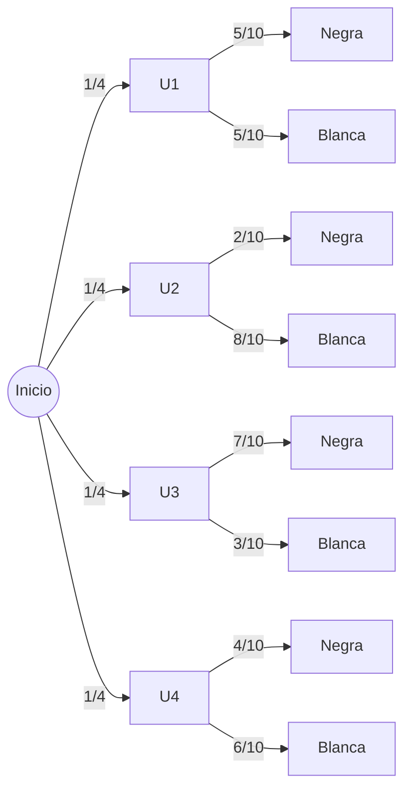

# Modelo Primer Parcial

## Problema 1. 

De una baraja de 52 cartas se sacan 3 cartas al azar.(sin reemplazo). ¿Cuál es la posibilidad de obtener exactamente 1 rey, 1 reina y 1 sota?(sin importar el orden)

### Fórmula de combinación

\(
C(n,r)=\frac{n!}{r!(n-r)!}
\)

---

### Casos posibles

\(
C(52,3)=\frac{52!}{3!(52-3)!}=22100
\)

---

### Casos favorables

\(
C(4,1)\cdot C(4,1)\cdot C(4,1)
\)

\(
=4\cdot4\cdot4=64
\)

---

### Probabilidad

\(
P=\frac{\text{casos favorables}}{\text{casos posibles}}
\)

\(
P=\frac{64}{22100}\approx0{,}0029
\)

## 2.
Cada urna contiene canicas negras y blancas. Su composición es la siguiente: 
U1: 5 blancas, 5 negras
U2: 8 blancas, 2 negras
U3: 3 blancas, 7 negras
U4: 6 blancas, 4 negras

a - ¿Cuál es la prob de sacar una canica negra?
b - Se elige una urna al azar y se sacan 3 canicas blancas sin reposicion¿Cuál es la prob que venga de U2?

## Probabilidades de sacar una canica negra

\(
P(N|U_1)=\frac{5}{10}=0{,}5
\)

\(
P(N|U_2)=\frac{2}{10}=0{,}2
\)

\(
P(N|U_3)=\frac{7}{10}=0{,}7
\)

\(
P(N|U_4)=\frac{4}{10}=0{,}4
\)

---

## Si las urnas se eligen al azar

\(
P(U_i)=\frac{1}{4}
\)

Entonces:

\(
P(N)=\sum P(U_i)\cdot P(N|U_i)
\)

\(
P(N)=
\frac{1}{4}(0{,}5)
+
\frac{1}{4}(0{,}2)
+
\frac{1}{4}(0{,}7)
+
\frac{1}{4}(0{,}4)
\)

\(
P(N)=0{,}125+0{,}05+0{,}175+0{,}1
\)

\(
P(N)=0{,}45
\)

---

## Datos

\(
P(U_i)=\frac{1}{4}
\)

Urna \(U_2\):

\(
8 \text{ blancas},\ 2 \text{ negras}
\)

---

## Probabilidad de sacar 3 blancas de \(U_2\)

\(
P(3B|U_2)=\frac{8}{10}\cdot\frac{7}{9}\cdot\frac{6}{8}
\)

\(
P(3B|U_2)=\frac{7}{15}
\)

---

## Probabilidad total de sacar 3 blancas

\(
P(3B)=\sum P(U_i)\cdot P(3B|U_i)
\)

---

### Desde \(U_1\)

\(
P(3B|U_1)=\frac{5}{10}\cdot\frac{4}{9}\cdot\frac{3}{8}=\frac{1}{12}
\)

---

### Desde \(U_2\)

\(
P(3B|U_2)=\frac{7}{15}
\)

---

### Desde \(U_3\)

\(
P(3B|U_3)=\frac{3}{10}\cdot\frac{2}{9}\cdot\frac{1}{8}=\frac{1}{120}
\)

---

### Desde \(U_4\)

\(
P(3B|U_4)=\frac{6}{10}\cdot\frac{5}{9}\cdot\frac{4}{8}=\frac{1}{6}
\)

---

## Probabilidad total

\(
P(3B)=
\frac{1}{4}\left(
\frac{1}{12}
+\frac{7}{15}
+\frac{1}{120}
+\frac{1}{6}
\right)
\)

\(
P(3B)=\frac{29}{160}
\)

---

## Teorema de Bayes

\(
P(U_2|3B)=\frac{P(U_2)\cdot P(3B|U_2)}{P(3B)}
\)

\(
P(U_2|3B)=
\frac{
\frac{1}{4}\cdot\frac{7}{15}
}{
\frac{29}{160}
}
\)

\(
P(U_2|3B)=\frac{56}{87}
\)

\(
P(U_2|3B)\approx0{,}644
\)

---

## Resultado

\(
\boxed{P(U_2|3B)\approx64{,}4\%}
\)

## 3.
Tres jugadores D, E y F tienen las siguientes probabilidades de encestar un tiro libre D = 88%, E= 60%, F= 40% de las veces, si cada uno lanza un tiro libre calcula la probabilidad de que exactamenr dos de ellos encesten.

Sea:

- \( D \): “el jugador D encesta”
- \( E \): “el jugador E encesta”
- \( F \): “el jugador F encesta”

Datos:

\(
P(D)=0.88
\)

\(
P(E)=0.60
\)

\(
P(F)=0.40
\)

Las probabilidades de fallar son:

\(
P(D^c)=1-0.88=0.12
\)

\(
P(E^c)=1-0.60=0.40
\)

\(
P(F^c)=1-0.40=0.60
\)

Queremos calcular la probabilidad de que exactamente dos jugadores encesten.

Los casos posibles son:

1. D y E encestan, F falla.

\(
P(D \cap E \cap F^c)=0.88 \times 0.60 \times 0.60
\)

\(
P(D \cap E \cap F^c)=0.3168
\)

2. D y F encestan, E falla.

\(
P(D \cap E^c \cap F)=0.88 \times 0.40 \times 0.40
\)

\(
P(D \cap E^c \cap F)=0.1408
\)

3. E y F encestan, D falla.

\(
P(D^c \cap E \cap F)=0.12 \times 0.60 \times 0.40
\)

\(
P(D^c \cap E \cap F)=0.0288
\)

Sumamos los tres casos:

\(
P(\text{exactamente dos encestan})=
0.3168+0.1408+0.0288
\)

\(
P(\text{exactamente dos encestan})=0.4864
\)

Respuesta:

\(
\boxed{0.4864=48.64\%}
\)

## 4. 
En una universidad se sabe que el 60% de los estudiantes cursa materias optativas. El 25% participa en proyectos de invetigación. El 70% cursa materias optativas o participa en investigación. Calcular la probalidad de elegir: 
a. Un estudiante que participa en investigación dado que cursa materias optativas.
b. Un estudiante que participa en investigación dado que NO cursa materias optativas.
Sea:

- \( O \): “el estudiante cursa materias optativas”
- \( I \): “el estudiante participa en investigación”

Datos:

\(
P(O)=0.60
\)

\(
P(I)=0.25
\)

\(
P(O \cup I)=0.70
\)

Usamos la fórmula:

\(
P(O \cup I)=P(O)+P(I)-P(O \cap I)
\)

Sustituyendo:

\(
0.70=0.60+0.25-P(O \cap I)
\)

\(
P(O \cap I)=0.60+0.25-0.70
\)

\(
P(O \cap I)=0.15
\)

# a) Probabilidad de que participe en investigación dado que cursa optativas

Usamos probabilidad condicional:

\(
P(I \mid O)=\frac{P(O \cap I)}{P(O)}
\)

Sustituyendo:

\(
P(I \mid O)=\frac{0.15}{0.60}
\)

\(
P(I \mid O)=0.25
\)

Respuesta:

\(
\boxed{P(I \mid O)=0.25=25\%}
\)

# b. Probabilidad de que participe en investigación dado que NO cursa optativas

Primero calculamos:

\(
P(O^c)=1-0.60=0.40
\)

Luego:

\(
P(I \cap O^c)=P(I)-P(O \cap I)
\)

\(
P(I \cap O^c)=0.25-0.15=0.10
\)

Ahora aplicamos probabilidad condicional:

\(
P(I \mid O^c)=\frac{P(I \cap O^c)}{P(O^c)}
\)

Sustituyendo:

\(
P(I \mid O^c)=\frac{0.10}{0.40}
\)

\(
P(I \mid O^c)=0.25
\)

Respuesta:

\(
\boxed{P(I \mid O^c)=0.25=25\%}
\)

## 5. 
En una empresa se midió el tiempo que los empleados tardan en completar una tarea específica(en minutos): los tiempos registrados en una muestrad de 40 empleados fueron los siguientes:

| Tiempo (minutos) | f  |
|------------------|----|
| [10;15)          | 4  | 
| [15;20)          | 9  |
| [20;25)          | 14 |
| [25;30)          | 7  |
| [30;35)          | 6  |

**Hallar**

### a.
Media, mediana e intervalo modal

### b.
 Varianza y desvío estándard
### c. 
Cuartil 1

# Datos

| Tiempo (minutos) | \(f\) |
|------------------|------|
| \([10;15)\) | 4 |
| \([15;20)\) | 9 |
| \([20;25)\) | 14 |
| \([25;30)\) | 7 |
| \([30;35)\) | 6 |

Total de datos:

\(
N=4+9+14+7+6=40
\)

Calculamos las marcas de clase:

| Intervalo | Marca de clase \(x_i\) | \(f_i\) | \(f_i x_i\) |
|---|---|---|---|
| \([10;15)\) | 12.5 | 4 | 50 |
| \([15;20)\) | 17.5 | 9 | 157.5 |
| \([20;25)\) | 22.5 | 14 | 315 |
| \([25;30)\) | 27.5 | 7 | 192.5 |
| \([30;35)\) | 32.5 | 6 | 195 |

\(
\sum f_i x_i = 910
\)

# a) Media, mediana e intervalo modal

## Media

\(
\bar{x}=\frac{\sum f_i x_i}{N}
\)

\(
\bar{x}=\frac{910}{40}
\)

\(
\bar{x}=22.75
\)

Respuesta:

\(
\boxed{\bar{x}=22.75 \text{ minutos}}
\)

---

## Mediana

Calculamos las frecuencias acumuladas:

| Intervalo | \(f_i\) | \(F_i\) |
|---|---|---|
| \([10;15)\) | 4 | 4 |
| \([15;20)\) | 9 | 13 |
| \([20;25)\) | 14 | 27 |
| \([25;30)\) | 7 | 34 |
| \([30;35)\) | 6 | 40 |

\(
\frac{N}{2}=\frac{40}{2}=20
\)

El dato 20 pertenece al intervalo:

\(
[20;25)
\)

Ese es el intervalo mediano.

Usamos:

\(
Me=L+\left(\frac{\frac{N}{2}-F_{anterior}}{f_m}\right)c
\)

Donde:

- \(L=20\)
- \(F_{anterior}=13\)
- \(f_m=14\)
- \(c=5\)

Sustituyendo:

\(
Me=20+\left(\frac{20-13}{14}\right)5
\)

\(
Me=20+\left(\frac{7}{14}\right)5
\)

\(
Me=20+2.5
\)

\(
Me=22.5
\)

Respuesta:

\(
\boxed{Me=22.5 \text{ minutos}}
\)

---

## Intervalo modal

La mayor frecuencia es:

\(
f=14
\)

Entonces el intervalo modal es:

\(
\boxed{[20;25)}
\)

# b) Varianza y desvío estándar

Calculamos:

| \(x_i\) | \(f_i\) | \(x_i-\bar{x}\) | \((x_i-\bar{x})^2\) | \(f_i(x_i-\bar{x})^2\) |
|---|---|---|---|---|
| 12.5 | 4 | -10.25 | 105.0625 | 420.25 |
| 17.5 | 9 | -5.25 | 27.5625 | 248.0625 |
| 22.5 | 14 | -0.25 | 0.0625 | 0.875 |
| 27.5 | 7 | 4.75 | 22.5625 | 157.9375 |
| 32.5 | 6 | 9.75 | 95.0625 | 570.375 |

\(
\sum f_i(x_i-\bar{x})^2=1397.5
\)

## Varianza

\(
\sigma^2=\frac{\sum f_i(x_i-\bar{x})^2}{N}
\)

\(
\sigma^2=\frac{1397.5}{40}
\)

\(
\sigma^2=34.9375
\)

Respuesta:

\(
\boxed{\sigma^2=34.94}
\)

---

## Desvío estándar

\(
\sigma=\sqrt{34.9375}
\)

\(
\sigma\approx5.91
\)

Respuesta:

\(
\boxed{\sigma\approx5.91 \text{ minutos}}
\)

# c. Cuartil 1

\(
\frac{N}{4}=\frac{40}{4}=10
\)

El dato 10 pertenece al intervalo(ver fk):

\(
[15;20)
\)

Usamos:

\(
Q_1=L+\left(\frac{\frac{N}{4}-F_{anterior}}{f_i}\right)c
\)

Donde:

- \(L=15\)
- \(F_{anterior}=4\)
- \(f_i=9\)
- \(c=5\)

Sustituyendo:

\(
Q_1=15+\left(\frac{10-4}{9}\right)5
\)

\(
Q_1=15+\left(\frac{6}{9}\right)5
\)

\(
Q_1=15+3.33
\)

\(
Q_1\approx18.33
\)

Respuesta:

\(
\boxed{Q_1\approx18.33 \text{ minutos}}
\)