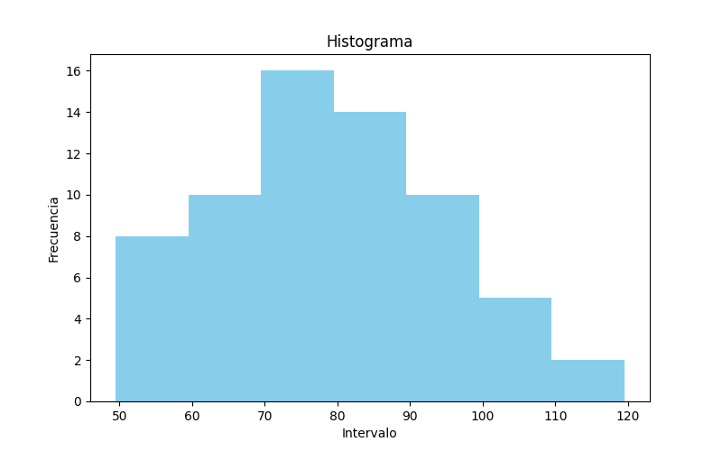
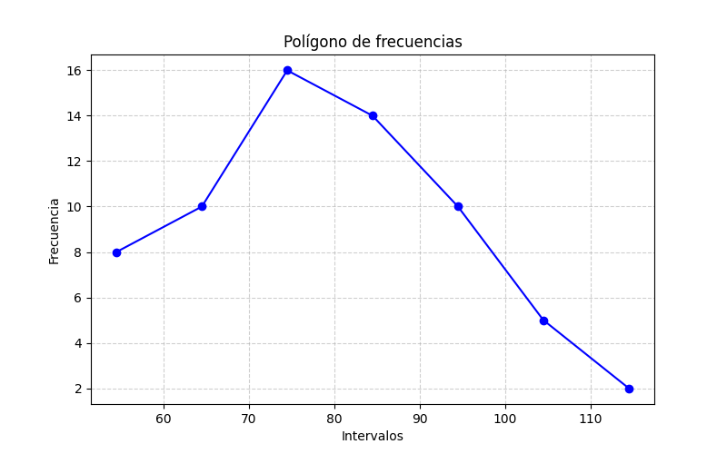
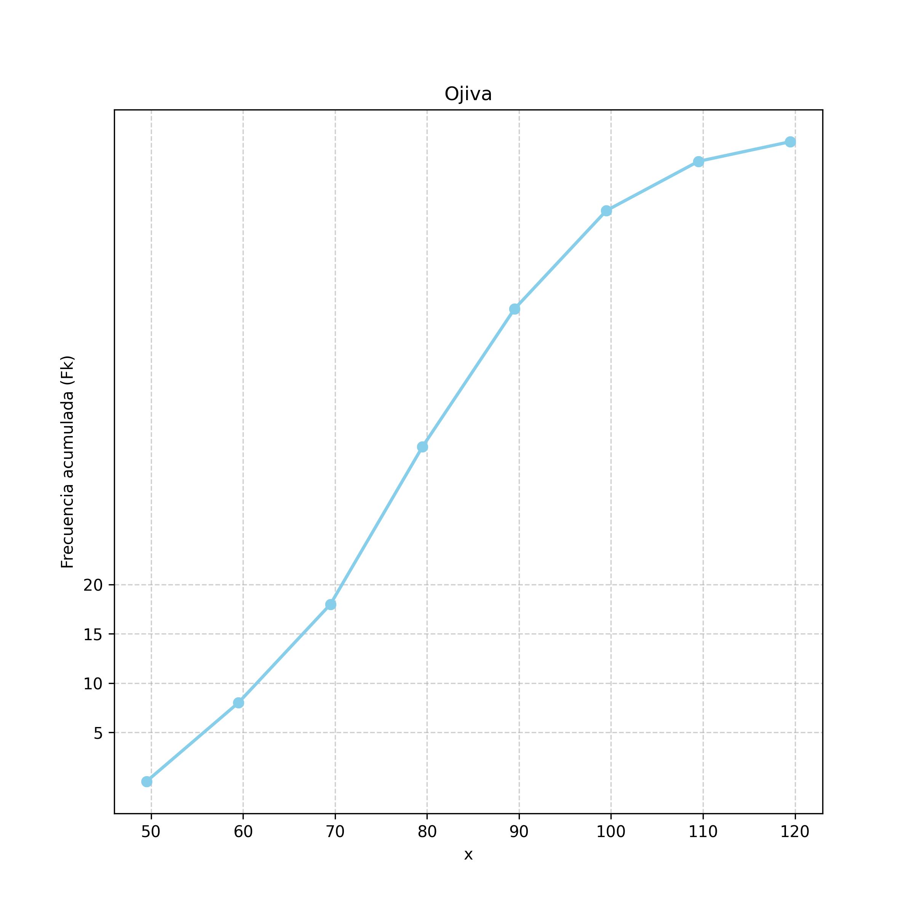

# Unidad 1 - Datos estadísticos

## 1.
Piezas Defectuosas - Piezas rechazadas por lote
|   |   |   |   |   |   |   |   |   |   |
|---|---|---|---|---|---|---|---|---|---|
| 0 | 7 | 2 | 4 | 1 | 2 | 1 | 5 | 4 | 3 |
| 6 | 2 | 6 | 1 | 0 | 2 | 4 | 7 | 5 | 1 |

elaborar la distribucion de frecuencias para la variable aleatoria discreta

 
#### Conteo

| x (piezas rechazadas) | cantidad |
|-----------------------|----------|
| 0                     | 2        |
| 1                     | 4        |
| 2                     | 4        |
| 3                     | 1        |
| 4                     | 3        |
| 5                     | 2        |
| 6                     | 2        |
| 7                     | 2        |

<!--Data: [2,4,4,1,3,2,2,2] -->
**Total:**  
- n = 20  

#### Distribución de frecuencias

| x | fi | fir  | fir% | Fk  | fkr  | fkr% |
|---|----|------|------|-----|------|------|
| 0 | 2  | 0.10 | 10%  | 2   | 0.10 | 10%  |
| 1 | 4  | 0.20 | 20%  | 6   | 0.30 | 30%  |
| 2 | 4  | 0.20 | 20%  | 10  | 0.50 | 50%  |
| 3 | 1  | 0.05 | 5%   | 11  | 0.55 | 55%  |
| 4 | 3  | 0.15 | 15%  | 14  | 0.70 | 70%  |
| 5 | 2  | 0.10 | 10%  | 16  | 0.80 | 80%  |
| 6 | 2  | 0.10 | 10%  | 18  | 0.90 | 90%  |
| 7 | 2  | 0.10 | 10%  | 20  | 1.00 | 100% |

    Fk = [2, 6, 10, 11, 14, 16, 18, 20 ]
#### Media

Media aritmética = promedio
<!-- n=20 -->
<!-- X= 63 / 20 -->
Total de fallos: (0 + 7 + 2 + 4 + 1 + 2 + 1 + 5 + 4 + 3 + 6 + 2 + 6 + 1 + 0 + 2 + 4 + 7 + 5 + 1)

\( t = 63 \)
\( n = 20 \)
\( \bar{x} = \frac{63}{20} = 3.15 \)

#### Mediana 
ordenar de menos a mayor:
+ Si el número total es impar mediana es elemento central
+ Si es par promedio de elemento central y n +1

entonces:  
| Posición | Fallos |
|----------|--------|
| 1        | 0      |
| 2        | 0      |
| 3        | 1      |
| 4        | 1      |
| 5        | 1      |
| 6        | 1      |
| 7        | 2      |
| 8        | 2      |
| 9        | 2      |
| 10       | 2      | -> 3+2/2
| 11       | 3      |
| 12       | 4      |
| 13       | 4      |
| 14       | 4      |
| 15       | 5      |
| 16       | 5      |
| 17       | 6      |
| 18       | 6      |
| 19       | 7      |
| 20       | 7      |

\(\tilde{x} = \frac{3+2}{2} = \frac{5}{2} = 2.5\)

#### Varianza

##### Tabla resumen para cálculo de varianza

| x (fallos) | fi (lotes) | fi·x | fi·x² |
|------------|------------|------|-------|
| 0          | 2          | 0    | 0     |
| 1          | 4          | 4    | 4     |
| 2          | 4          | 8    | 16    |
| 3          | 1          | 3    | 9     |
| 4          | 3          | 12   | 48    |
| 5          | 2          | 10   | 50    |
| 6          | 2          | 12   | 72    |
| 7          | 2          | 14   | 98    |
| **Totales**| **20**     | **63** | **297** |

##### Fórmulas

Media:

\(
\bar{x} = \frac{\sum f_i \cdot x_i}{n} = \frac{63}{20} = 3.15
\)

**Varianza:**

\(
s^2 = \frac{\sum f_i \cdot x_i^2}{n} - \bar{x}^2
\)

Sustituyendo valores:

\(
s^2 = \frac{297}{20} - (3.15)^2 = 14.85 - 9.9225 = 4.9275
\)

#### Desviación estándar:

\(s = \sqrt{s^2}\)
en este caso

\(
s = \sqrt{4.9275} = 2,219797288
\)

### Gráficos 

#### Frecuencias Absolutas
##### Diagrama de Barras

#### #Histograma

#### Frecuencias Acumuladas

##### Ojiva

## 2.
Tabla de Pesos, en Kg
|       |       |       |       |       |       |       |       |       |       |
|-------|-------|-------|-------|-------|-------|-------|-------|-------|-------|
| 92.3  | 94.0  | 94.4  | 95.7  | 96.1  | 96.4  | 97.2  | 97.5  | 97.9  | 98.3  |
| 98.4  | 98.5  | 98.6  | 98.9  | 99.3  | 99.6  | 100.0 | 100.0 | 100.1 | 100.3 |
| 100.5 | 100.7 | 100.8 | 101.1 | 101.2 | 101.5 | 102.1 | 102.5 | 102.9 | 103.8 |

Usamos:

- Límite inferior inicial: \( 92.0 \)
- Tamaño de clase: \( 2.0 \)
- Número total de datos: \( 30 \)

Los intervalos de clase serán:

- \( 92.0 \) a \( <94.0 \)
- \( 94.0 \) a \( <96.0 \)
- \( 96.0 \) a \( <98.0 \)
- \( 98.0 \) a \( <100.0 \)
- \( 100.0 \) a \( <102.0 \)
- \( 102.0 \) a \( <104.0 \)

Número total de datos:

\(
n=30
\)

| Clase | Intervalo (Kg) | \(fi\) | \(fir\) | \(fir\%\) | \(Fk\) | \(fkr\) | \(fkr\%\) |
|-------|----------------|--------|---------|-----------|-------|----------|-----------|
| 1     | 92–94          |  1     | 0.0333  | 3.33%     | 1     | 0.0333   | 3.33%     |
| 2     | 94–96          |  3     | 0.1000  | 10.00%    | 4     | 0.1333   | 13.33%    |
| 3     | 96–98          |  5     | 0.1667  | 16.67%    | 9     | 0.3000   | 30.00%    |
| 4     | 98–100         |  7     | 0.2333  | 23.33%    | 16    | 0.5333   | 53.33%    |
| 5     | 100–102        | 10     | 0.3333  | 33.33%    | 26    | 0.8667   | 86.67%    |
| 6     | 102–104        |  4     | 0.1333  | 13.33%    | 30    | 1.0000   | 100.00%   |

donde:

- \(fi\): frecuencia absoluta.
- \(fir\): frecuencia relativa.
- \(fir\%\): frecuencia relativa porcentual.
- \(Fk\): frecuencia acumulada.
- \(fkr\): frecuencia relativa acumulada.
- \(fkr\%\): frecuencia relativa acumulada porcentual.

donde:

- \(fi\): frecuencia absoluta.
- \(fir\): frecuencia relativa.
- \(fir\%\): frecuencia relativa porcentual.
- \(Fk\): frecuencia acumulada.
- \(fkr\): frecuencia relativa acumulada.
- \(fkr\%\): frecuencia relativa acumulada porcentual.
### Mediana
### Cálculo de la mediana para datos agrupados

La posición de la mediana es:

\( \frac{N}{2} = \frac{30}{2} = 15 \)

La frecuencia acumulada muestra que el dato 15 cae en la clase:

**98–100**

Por lo tanto:

- \( L = 98 \) → límite inferior de la clase mediana  
- \( F_{n-1} = 9 \) → frecuencia acumulada anterior a la clase mediana  
- \( f_m = 7 \) → frecuencia de la clase mediana  
- \( c = 2 \) → amplitud de clase  
- \( N = 30 \)

La fórmula de la mediana para datos agrupados es:

\( \tilde{x} = L + \left( \frac{\frac{N}{2} - F_{n-1}}{f_m} \right)c \)

Sustituyendo:

\( \tilde{x} = 98 + \left( \frac{15 - 9}{7} \right)(2) \)

\( \tilde{x} = 98 + \left( \frac{6}{7} \right)(2) = 98 + 1.7142857 \approx 99.71 \)

Por lo tanto, la mediana agrupada es:

**\( \tilde{x} \approx 99.71 \)**

### Moda
\(\text{Mo} \)
La fórmula de la moda para datos agrupados es:

\(
\text{Mo} = L_i + \frac{(f_m - f_{m-1})}{(f_m - f_{m-1}) + (f_m - f_{m+1})} \cdot h
\)

donde:

- \(L_i\): límite inferior de la clase modal.
- \(f_m\): frecuencia de la clase modal.
- \(f_{m-1}\): frecuencia de la clase anterior.
- \(f_{m+1}\): frecuencia de la clase siguiente.
- \(h\): amplitud del intervalo.

---

La clase modal es:

\(100\text{–}102\)

porque tiene la mayor frecuencia.

Entonces:

- \(L_i = 100\)
- \(f_m = 10\)
- \(f_{m-1} = 7\)
- \(f_{m+1} = 4\)
- \(h = 2\)

Sustituyendo:

\(
\text{Mo} = 100 + \frac{(10-7)}{(10-7)+(10-4)} \cdot 2 = 100 + \frac{(3)}{(3)+(6)} \cdot 2
\)

Entonces:

\(
\text{Mo} = 100 + \frac{3}{3+6}\cdot2 = 100 + \frac{3}{9}\cdot2
\)

\(
\text{Mo} = 100 + 0.6666
\)

\(
\text{Mo} \approx 100.66
\)

Por lo tanto, la moda agrupada es:

\(
\boxed{100.67\text{ kg}}
\)

3. Frecuecia de Diámetros

---
## 3. 

Tabla

| Diametro (cm) | N° de árboles |
|---------------|---------------|
| 50 a 59       |  8            |
| 60 a 69       | 10            |
| 70 a 79       | 16            |
| 80 a 89       | 14            |
| 90 a 99       | 10            |
| 100 a 109     |  5            |
| 110 a 119     |  2            |

---
### 3 - a. Limite inferior de la 6ta clase 

### Tabla de frecuencias

| Clase | Intervalo (cm) | \(fi\) | \(Fk\) |
|-------|----------------|--------|--------|
| 1     | 50–59          | 8      | 8      |
| 2     | 60–69          | 10     | 18     |
| 3     | 70–79          | 16     | 34     |
| 4     | 80–89          | 14     | 48     |
| 5     | 90–99          | 10     | 58     |
| 6     | 100–109        | 5      | 63     |
| 7     | 110–119        | 2      | 65     |

Total de observaciones:

\( N = 65 \)

La pregunta solicita el **límite inferior de la 6° clase**.

La sexta clase es: **100–109**

Por lo tanto, el límite inferior de la sexta clase es:

\( L_i = 100 \text{ cm} \)

### 3 - b. Limite superior de la 4ta clase 

La cuarta clase es: **80–89**
\( L_s = 89 \text{ cm} \)

### 3 - c. Marca de clase de la 3° clase

La tercera clase es:**70–79**
La marca de clase se calcula como el punto medio del intervalo:
\( X_i = \frac{L_i + L_s}{2} \)
Donde:- \( L_i = 70 \)- \( L_s = 79 \)
Sustituyendo:\( X_i = \frac{70 + 79}{2} \) \( X_i = \frac{149}{2} \)\( X_i = 74.5 \)
Por lo tanto, la marca de clase de la tercera clase es: \( X_i = 74.5 \text{ cm} \)

### 4 - d. Limites reales de la 5ta clase

### Cálculo de los límites reales de la 5° clase

La quinta clase es:

**90–99**

Para obtener los límites reales, se resta y suma la mitad de la unidad de medida.

Como los datos están expresados en centímetros enteros, se utiliza:

\( \frac{1}{2} = 0.5 \)

La fórmula es:

- Límite real inferior:

\( LRI = L_i - 0.5 \)

- Límite real superior:

\( LRS = L_s + 0.5 \)

Donde:

- \( L_i = 90 \)
- \( L_s = 99 \)

Sustituyendo:

\( LRI = 90 - 0.5 = 89.5 \)

\( LRS = 99 + 0.5 = 99.5 \)

Por lo tanto, los límites reales de la quinta clase son:

**\( (89.5;\ 99.5) \)**

### e. Tamaño del 5to Intervalo

La quinta clase es:

**90–99**

El tamaño o amplitud del intervalo de clase se calcula como:

\( c = L_s - L_i + 1 \)

Donde:

- \( L_i = 90 \)
- \( L_s = 99 \)

Sustituyendo:

\( c = 99 - 90 + 1 \)

\( c = 10 \)

Por lo tanto, el tamaño del quinto intervalo de clase es:

**\( c = 10 \text{ cm} \)**

### 3 - f. Frecuencia de la 3° clase

La tercera clase corresponde al intervalo:

**70–79**

Según la tabla de frecuencias:

| Clase | Intervalo (cm) | \(fi\) |
|-------|----------------|--------|
| 3     | 70–79          | 16     |

Por lo tanto, la frecuencia de la tercera clase es:

**\( fi = 16 \)**

### 3 - g. Frecuencia Relativa de la 3er Clase

#### Cálculo de la frecuencia relativa de la 3° clase

La frecuencia relativa se calcula como:

\( f_{ir} = \frac{f_i}{N} \)

Donde:

- \( f_i = 16 \) → frecuencia de la tercera clase  
- \( N = 65 \) → total de observaciones  

Sustituyendo:

\( f_{ir} = \frac{16}{65} \)

\( f_{ir} = 0.246153 \)

Por lo tanto, la frecuencia relativa de la tercera clase es:

**\( f_{ir} = 0.246153 \)**

### 3 - h. Intervalo de clase de mayor frecuencia

Según la tabla: 

| Clase | Intervalo (cm) | \(fi\) | \(Fk\) |
|-------|----------------|--------|--------|
| 3     | 70–79          | 16     | 34     |

El intervalo de clase con mayor frecuencia es la 3ra Clase

## 4. 
#### Histograma

#### Poligono de Frecuencias

## 5.

#### Ojiva

La fórmula es:

\( F_k = \sum f_i \)

Usando los datos del ejercicio:

| Clase | Intervalo (cm) | \(fi\) | \(Fk\) |
|-------|----------------|--------|--------|
| 1     | 50–59          | 8      | 8      |
| 2     | 60–69          | 10     | 18     |
| 3     | 70–79          | 16     | 34     |
| 4     | 80–89          | 14     | 48     |
| 5     | 90–99          | 10     | 58     |
| 6     | 100–109        | 5      | 63     |
| 7     | 110–119        | 2      | 65     |

## 6. 

### Cálculo de la media para datos agrupados

La media aritmética para datos agrupados se calcula con:

\( \bar{x} = \frac{\sum f_i X_i}{N} \)

Donde:

- \( f_i \) = frecuencia de cada clase  
- \( X_i \) = marca de clase  
- \( N \) = total de observaciones  

Tabla auxiliar:

| Intervalo (cm) | \(X_i\) | \(f_i\) | \(f_i X_i\) |
|----------------|---------|---------|-------------|
| 50–59          | 54.5    | 8       | 436.0       |
| 60–69          | 64.5    | 10      | 645.0       |
| 70–79          | 74.5    | 16      | 1192.0      |
| 80–89          | 84.5    | 14      | 1183.0      |
| 90–99          | 94.5    | 10      | 945.0       |
| 100–109        | 104.5   | 5       | 522.5       |
| 110–119        | 114.5   | 2       | 229.0       |

Suma:

\( \sum f_i X_i = 5152.5 \)

Total de datos:

\( N = 65 \)

Sustituyendo:

\( \bar{x} = \frac{5152.5}{65} \)

\( \bar{x} = 79.2692 \)

Por lo tanto, la media es:

**\( \bar{x} \approx 79.27 \text{ cm} \)**

---
### Cálculo de la mediana para datos agrupados

La mediana para datos agrupados se calcula con:

\( \tilde{x} = L_i + \left( \frac{\frac{N}{2} - F_{n-1}}{f_m} \right)c \)

Donde:

- \( N = 65 \)
- \( \frac{N}{2} = 32.5 \)
- \( L_i \) = límite inferior aparente de la clase mediana  
- \( F_{n-1} \) = frecuencia acumulada anterior a la clase mediana  
- \( f_m \) = frecuencia de la clase mediana  
- \( c \) = amplitud del intervalo  

Tabla de frecuencias acumuladas:

| Intervalo (cm) | \(fi\) | \(Fk\) |
|----------------|--------|--------|
| 50–59   | 8  | 8  |
| 60–69   | 10 | 18 |
| 70–79   | 16 | 34 |
| 80–89   | 14 | 48 |
| 90–99   | 10 | 58 |
| 100–109 | 5  | 63 |
| 110–119 | 2  | 65 |

Como \( 32.5 \) cae dentro de la clase **70–79**, esa es la clase mediana.

Por lo tanto:

- \( L_i = 70 \)  
- \( F_{n-1} = 18 \)  
- \( f_m = 16 \)  
- \( c = 10 \)  

Sustituyendo:

\( \tilde{x} = 70 + \left( \frac{32.5 - 18}{16} \right)(10) \)

\( \tilde{x} = 70 + \left( \frac{14.5}{16} \right)(10) \)

\( \tilde{x} = 70 + 9.0625 \)

\( \tilde{x} = 79.0625 \)

Por lo tanto, la mediana es:

**\( \tilde{x} \approx 79.06 \text{ cm} \)**

> **WARNING:** Consultar este punto: Límite real vs. límite aparente, diferencia con guía
---

### Cálculo de la moda para datos agrupados

La moda se calcula con:

\( Mo = L_i + \left( \frac{d_1}{d_1 + d_2} \right)c \)

Donde:

- \( L_i \) = límite inferior de la clase modal  
- \( d_1 = f_m - f_{anterior} \)  
- \( d_2 = f_m - f_{siguiente} \)  
- \( c \) = amplitud del intervalo  

Tabla:

| Intervalo (cm) | \(fi\) |
|----------------|--------|
| 50–59   | 8  |
| 60–69   | 10 |
| 70–79   | 16 |
| 80–89   | 14 |
| 90–99   | 10 |
| 100–109 | 5  |
| 110–119 | 2  |

Clase modal: **70–79**

Datos:

- \( L_i = 70 \)
- \( f_m = 16 \)
- \( f_{anterior} = 10 \)
- \( f_{siguiente} = 14 \)
- \( c = 9 \)

Cálculos:

\( d_1 = 16 - 10 = 6 \)

\( d_2 = 16 - 14 = 2 \)

Sustituyendo:

\( Mo = 70 + \left( \frac{6}{6 + 2} \right)(9) \)

\( Mo = 70 + \left( \frac{6}{8} \right)(9) \)

\( Mo = 70 + 6.75 \)

\( Mo = 76.75 \)

##### Resultado:

\( Mo = 76.75 \text{ cm} \)

---
### Cálculo del Cuartil 1 (Q1) para datos agrupados

El cuartil 1 se calcula con:

\( Q_1 = L_i + \left( \frac{\frac{N}{4} - F_{n-1}}{f_m} \right)c \)

Donde:

- \( N = 65 \)
- \( \frac{N}{4} = 16.25 \)

---

#### A. Ubicación del cuartil

Frecuencia acumulada:

| Intervalo | \(Fk\) |
|-----------|--------|
| 50–59 | 8 |
| 60–69 | 18 |

Como:

\( 8 < 16.25 \le 18 \)

la clase de \(Q_1\) es:

**60–69**

---

#### B. Datos de la clase

- \( L_i = 60 \)
- \( F_{n-1} = 8 \)
- \( f_m = 10 \)
- \( c = 9 \)

---

#### C. Sustitución

\( Q_1 = 60 + \left( \frac{16.25 - 8}{10} \right)(9) \)

\( Q_1 = 60 + (0.825)(9) \)

\( Q_1 = 60 + 7.425 \)

\( Q_1 = 67.425 \)

---

##### Resultado

\( Q_1 = 67.425 \text{ cm} \)

---
### Cálculo del Cuartil 3 (Q3) para datos agrupados

El cuartil 3 se calcula con:

\( Q_3 = L_i + \left( \frac{\frac{3N}{4} - F_{n-1}}{f_m} \right)c \)

Donde:

- \( N = 65 \)
- \( \frac{3N}{4} = 48.75 \)

---

#### A. Ubicación del cuartil

Frecuencia acumulada:

| Intervalo | \(Fk\) |
|-----------|--------|
| 80–89 | 48 |
| 90–99 | 58 |

Como:

\( 48 < 48.75 \le 58 \)

la clase de \(Q_3\) es:

**90–99**

---

#### B. Datos de la clase

- \( L_i = 90 \)
- \( F_{n-1} = 48 \)
- \( f_m = 10 \)
- \( c = 9 \)

---

#### C. Sustitución

\( Q_3 = 90 + \left( \frac{48.75 - 48}{10} \right)(9) \)

\( Q_3 = 90 + (0.075)(9) \)

\( Q_3 = 90 + 0.675 \)

\( Q_3 = 90.675 \)

---

##### Resultado

\( Q_3 = 90.675 \text{ cm} \)

----

### Cálculo del Decil 8 (\(D_8\)) para datos agrupados

El decil 8 se calcula con:

\( D_8 = L_i + \left( \frac{\frac{8N}{10} - F_{n-1}}{f_m} \right)c \)

Donde:

- \( N = 65 \)
- \( \frac{8N}{10} = 52 \)

---

#### A. Ubicación del decil

Frecuencia acumulada:

| Intervalo | \(Fk\) |
|-----------|--------|
| 80–89 | 48 |
| 90–99 | 58 |

Como:

\( 48 < 52 \le 58 \)

la clase de \(D_8\) es:

**90–99**

---

#### B. Datos de la clase

- \( L_i = 90 \)
- \( F_{n-1} = 48 \)
- \( f_m = 10 \)
- \( c = 9 \)

---

#### C. Sustitución

\( D_8 = 90 + \left( \frac{52 - 48}{10} \right)(9) \)

\( D_8 = 90 + (0.4)(9) \)

\( D_8 = 90 + 3.6 \)

\( D_8 = 93.6 \)

---

##### Resultado

\( D_8 = 93.6 \text{ cm} \)

--- 

### Cálculo del percentil 14 (\(P_{14}\)) para datos agrupados

El percentil 14 se calcula con:

\( P_{14} = L_i + \left( \frac{\frac{14N}{100} - F_{n-1}}{f_m} \right)c \)

Donde:

- \( N = 65 \)
- \( \frac{14N}{100} = 9.1 \)

---

#### A. Ubicación del percentil

Frecuencia acumulada:

| Intervalo | \(Fk\) |
|-----------|--------|
| 50–59 | 8 |
| 60–69 | 18 |

Como:

\( 8 < 9.1 \le 18 \)

la clase de \(P_{14}\) es:

**60–69**

---

#### B. Datos de la clase

- \( L_i = 60 \)
- \( F_{n-1} = 8 \)
- \( f_m = 10 \)
- \( c = 9 \)

---

#### C. Sustitución

\( P_{14} = 60 + \left( \frac{9.1 - 8}{10} \right)(9) \)

\( P_{14} = 60 + (0.11)(9) \)

\( P_{14} = 60 + 0.99 \)

\( P_{14} = 60.99 \)

---

#### Resultado

\( P_{14} = 60.99 \text{ cm} \)

---

### Cálculo del percentil 74 (\(P_{74}\)) para datos agrupados

El percentil 74 se calcula con:

\( P_{74} = L_i + \left( \frac{\frac{74N}{100} - F_{n-1}}{f_m} \right)c \)

Donde:

- \( N = 65 \)
- \( \frac{74N}{100} = 48.1 \)

---

#### A. Ubicación del percentil

Frecuencia acumulada:

| Intervalo | \(Fk\) |
|-----------|--------|
| 80–89 | 48 |
| 90–99 | 58 |

Como:

\( 48 < 48.1 \le 58 \)

la clase de \(P_{74}\) es:

**90–99**

---

#### B. Datos de la clase

- \( L_i = 90 \)
- \( F_{n-1} = 48 \)
- \( f_m = 10 \)
- \( c = 9 \)

---

#### C. Sustitución

\( P_{74} = 90 + \left( \frac{48.1 - 48}{10} \right)(9) \)

\( P_{74} = 90 + (0.01)(9) \)

\( P_{74} = 90 + 0.09 \)

\( P_{74} = 90.09 \)

---

##### Resultado

\( P_{74} = 90.09 \text{ cm} \)

---

### Cálculo de la varianza para datos agrupados

La varianza se calcula con:

\( \sigma^2 = \frac{\sum f_i (X_i - \bar{x})^2}{N} \)

Donde:

- \( X_i \) = marca de clase  
- \( f_i \) = frecuencia  
- \( N = 65 \)

Primero calculamos la media con precisión completa:

\( \bar{x} = \frac{\sum f_i X_i}{N} \)

Tabla auxiliar:

| Intervalo (cm) | \(X_i\) | \(f_i\) | \(f_iX_i\) |
|----------------|---------|---------|------------|
| 50–59   | 54.5  | 8  | 436.0 |
| 60–69   | 64.5  | 10 | 645.0 |
| 70–79   | 74.5  | 16 | 1192.0 |
| 80–89   | 84.5  | 14 | 1183.0 |
| 90–99   | 94.5  | 10 | 945.0 |
| 100–109 | 104.5 | 5  | 522.5 |
| 110–119 | 114.5 | 2  | 229.0 |

Suma:

\( \sum f_iX_i = 5152.5 \)

Entonces:

\( \bar{x} = \frac{5152.5}{65} = 79.26923076923077 \)

---

### Tabla de cálculo de varianza

| \(X_i\) | \(f_i\) | \(X_i-\bar{x}\) | \((X_i-\bar{x})^2\) | \(f_i(X_i-\bar{x})^2\) |
|---------|---------|------------------|----------------------|-------------------------|
| 54.5  | 8  | -24.7692307692 | 613.5133136095 | 4908.1065088760 |
| 64.5  | 10 | -14.7692307692 | 218.1286982249 | 2181.2869822490 |
| 74.5  | 16 | -4.7692307692  | 22.7440828402  | 363.9053254432 |
| 84.5  | 14 | 5.2307692308   | 27.3594674556  | 383.0325443784 |
| 94.5  | 10 | 15.2307692308  | 231.9748520710 | 2319.7485207100 |
| 104.5 | 5  | 25.2307692308  | 636.5902366864 | 3182.9511834320 |
| 114.5 | 2  | 35.2307692308  | 1241.2056213018 | 2482.4112426036 |

Suma:

\( \sum f_i(X_i-\bar{x})^2 = 15821.5383076922 \)

Finalmente:

\( \sigma^2 = \frac{15821.5383076922}{65} \)

\( \sigma^2 = 243.4082816568 \)

#### Resultado

\( \sigma^2 \approx 243.40828 \text{ cm}^2 \)

---

### Cálculo de la desviación estándar para datos agrupados

La desviación estándar se calcula como la raíz cuadrada de la varianza:

\( \sigma = \sqrt{\sigma^2} \)

Usando la varianza obtenida:

\( \sigma^2 = 243.40828 \)

Sustituyendo:

\( \sigma = \sqrt{243.40828} \)

\( \sigma = 15.60155 \)

#### Resultado

\( \sigma \approx 15.60155 \text{ cm} \)

## 7. Trabajadores

N = 1965

| Rango de edades | N° de Trabajadores  |
|-----------------|---------------------|
| 60-64           |   373               |
| 65-69           |   733               |
| 70-74           |   489               |
| 75-79           |   240               |
| 80-84           |   102               |
| 85-89           |    28               |
| Total           |  1965               |

### Cálculo del cuartil 1 (\(Q_1\)) para datos agrupados

El cuartil 1 se calcula con:

\( Q_1 = L_i + \left( \frac{\frac{N}{4} - F_{n-1}}{f_m} \right)c \)

Donde:

- \( N = 1965 \)
- \( \frac{N}{4} = 491.25 \)

#### A. Tabla de frecuencias acumuladas

| Intervalo | \(fi\) | \(Fk\) |
|-----------|--------|--------|
| 60–64 | 373 | 373 |
| 65–69 | 733 | 1106 |
| 70–74 | 489 | 1595 |
| 75–79 | 240 | 1835 |
| 80–84 | 102 | 1937 |
| 85–89 | 28  | 1965 |

Como:

\( 373 < 491.25 \le 1106 \)

la clase de \(Q_1\) es:

**65–69**

#### B. Datos de la clase

- \( L_i = 65 \)
- \( F_{n-1} = 373 \)
- \( f_m = 733 \)
- \( c = 4 \)

#### C. Sustitución

\( Q_1 = 65 + \left( \frac{491.25 - 373}{733} \right)(4) \)

\( Q_1 = 65 + \left( \frac{118.25}{733} \right)(4) \)

\( Q_1 = 65 + 0.645293 \)

\( Q_1 = 65.645293 \)

#### Resultado

\( Q_1 = 65.645293 \text{ años} \)

---

### Cálculo del decil 6 (\(D_6\))

El decil 6 se calcula con:

\( D_6 = L_i + \left( \frac{\frac{6N}{10} - F_{n-1}}{f_m} \right)c \)

Donde:

- \( N = 1965 \)
- \( \frac{6N}{10} = 1179 \)

#### A. Ubicación del decil

Frecuencia acumulada:

| Intervalo | \(Fk\) |
|-----------|--------|
| 65–69 | 1106 |
| 70–74 | 1595 |

Como:

\( 1106 < 1179 \le 1595 \)

la clase de \(D_6\) es:

**70–74**

#### B. Datos de la clase

- \( L_i = 70 \)
- \( F_{n-1} = 1106 \)
- \( f_m = 489 \)
- \( c = 4 \)

#### C. Sustitución

\( D_6 = 70 + \left( \frac{1179 - 1106}{489} \right)(4) \)

\( D_6 = 70 + \left( \frac{73}{489} \right)(4) \)

\( D_6 = 70 + 0.597137 \)

\( D_6 = 70.597137 \)

#### Resultado

\( D_6 = 70.597137 \text{ años} \)

---
### 8.
Alturas
### 9.
Faltan 8 y 9