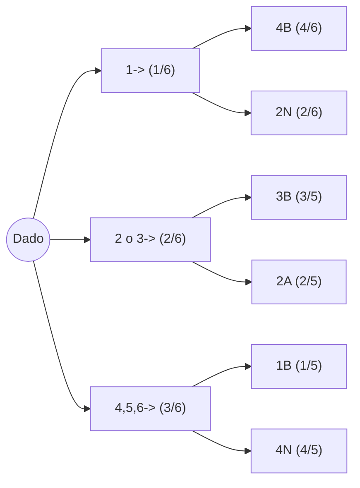

# Unidad 3

## 40. Dado:

```mermaid
flowchart LR
    F((Dado))

    F --> D1["1-> (1/6)"]
    F --> D23["2 o 3-> (2/6)"]
    F --> D456["4,5,6-> (3/6)"]

    D1 --> D1_B["4B (4/6)"]
    D1 --> D1_N["2N (2/6)"]

    D23 --> D23_B["3B (3/5)"]
    D23 --> D23_A["2A (2/5)"]

    D456 --> D456_B["1B (1/5)"]
    D456 --> D456_N["4N (4/5)"]
```
\(P(N) = \frac{1}{6} \cdot \frac{2}{6} + \frac{3}{6} \cdot \frac{4}{5} = \frac{41}{90}\)
