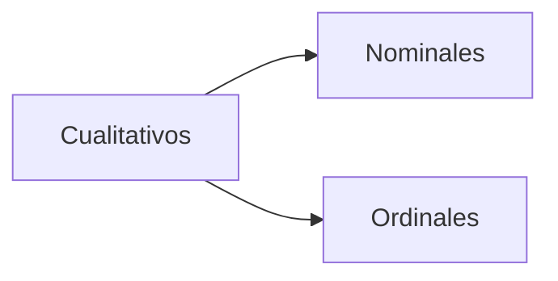
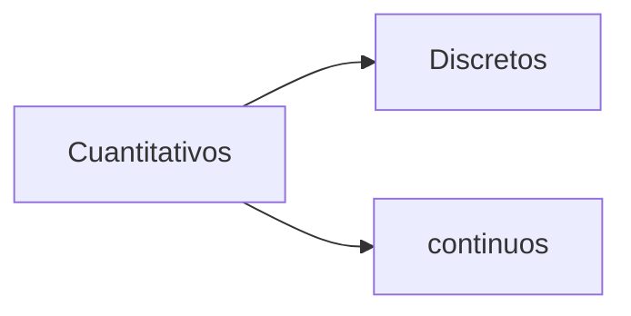
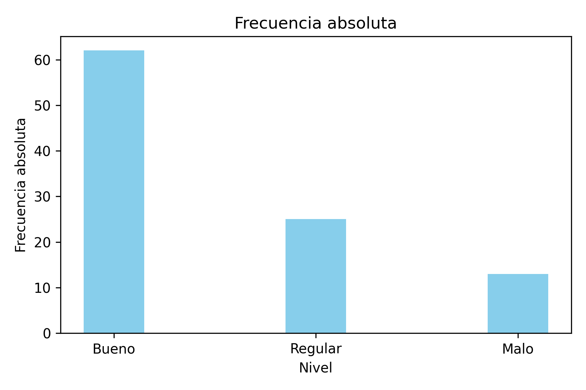
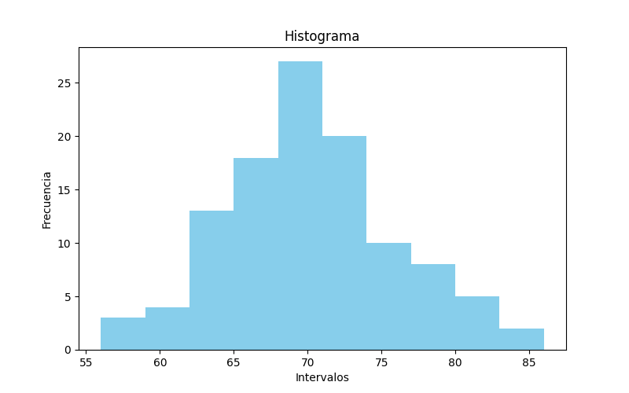
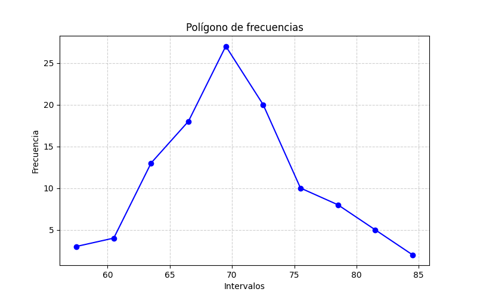
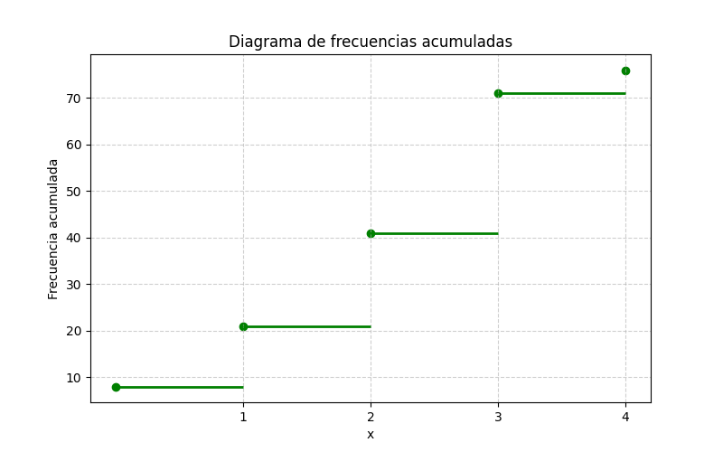
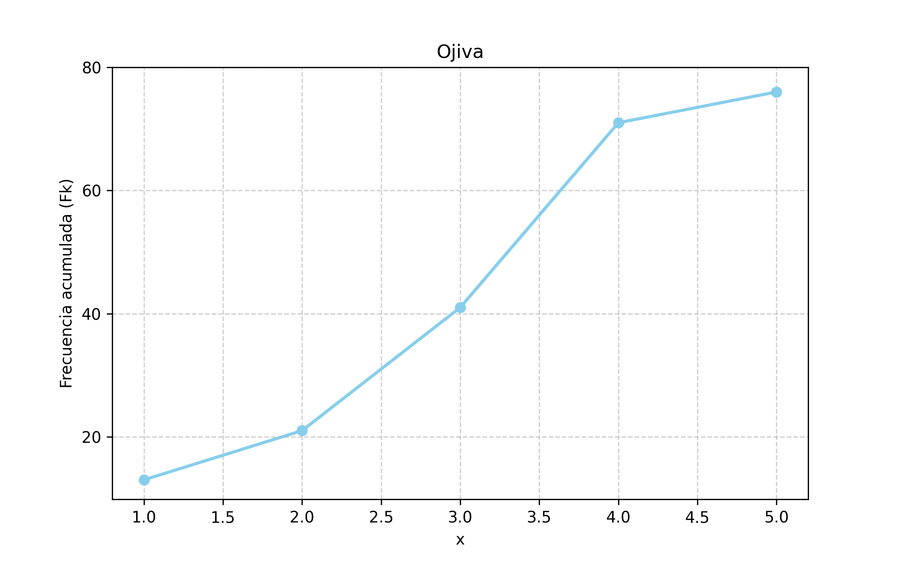
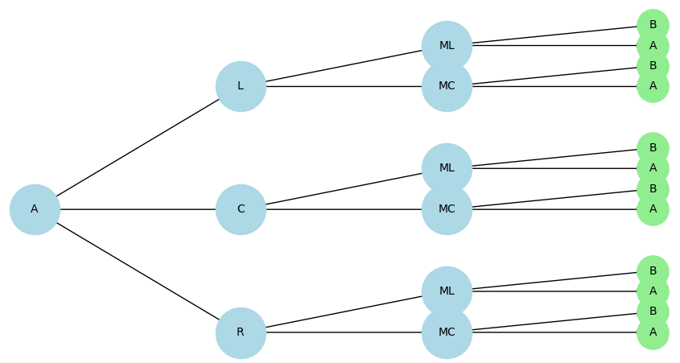

# Probabilidad y Estadística

## Fechas de Parciales 
+ 15/5 1er Parcial
+ 29/5 1er Parcial Recuperatorio
+ 15/5 1er Parcial
+ 26/6 2do Parcial
+  3/7 2do Parcial Recuperatorio y 1er Parcial Recuperatorio

## Unidad 1:
## Estadística Descriptiva e Inferencial 

La estadística se refiere en un sentido técnico, a una rama de la matemática aplicada que se ocupa de interpretar los resultados numéricos, elaborar tablas y gráficos explicativos y posteriormente inferir parámetros estadísticos. El conjunto de estas técnicas se denomina estadística descriptiva.

La es estadística es la ciencia que estudia a los fenómenos regidos por el azar, midiendo los riesgos y llevando a los valores numéricos los resultados de hechos aleatorios, observando el comportamiento de una muestra y generalizando conclusiones a toda una población. El conjunto de estas técnicas se llama estadística inferencial.

Algunas definiciones de estadística

**Población:** Se denomina población al conjunto de todos los elementos que cumplen una determinada característica, que deseamos medir o estudiar.

**Muestra:** Se denomina muestra a cualquier subconjunto de la población. 

**Unidad estadística:** Se considera a cada individuo de la una población una unidad estadística.

## Carácter Estadístico
<!-- 
+ Cualitativos
    + Nominales
    + Ordinales
+ Cuantitativos 
    + Discretos
    + Continuos
-->

 **Carácter Estadístico Cualitativo:** Es aquél no susceptible de ser medido ni contado.
 
 **Nominales:** Esta es una forma de observar o medir en la los datos se ajustan por categorías que no mantienen una relación de orden entre sí (color de ojos, religión, profesión, etc. ).

 **Ordinales:** En las escalas utilizadas, existe un cierto orden o jerarquía entre las categorías(Grados de fatiga, estudio de un tumor, estado sanitario de una población, etc.).

 **Carácter Estadístico Cuantitativo:** Es el que surge de un proceso de medición o conteo.

 **Discreto:** El carácter estadístico es discreto solo si entre 2 valores consecutivos del mismo no puede existir un valor intermedio. Su recorrido es del conjunto ℕ o ℤ

 **Continuos:** El carácter estadístico es continuo si entre 2 valores cualesquiera de su recorrido puede existir siempre uno intermedio. Su recorrido es el conjunto definido como los números ℝ

 ### Distribución de Frecuencias para la Variable Aleatoria Cualitativa

 #### Frecuencias Absolutas (\( f_i \))
 Número total de observaciones que pertenecen a cada clase o categoría.

 #### Frecuencias Relativas (\( f_{ir} \))
 Relación entre las frecuencias absolutas de cada modalidad y el número total de observaciones 

 \( f_{ir} = \frac{f_i}{n} \)

#### Frecuencias Relativas Porcentuales (\( f_{ir}\% \)) 
Expresión porcentual de las frecuencias relativas
\( f_{ir}\% = \frac{f_i}{n} \cdot 100 \)

### Distribución de Frecuencias para la variable cuantitativa Discreta

#### Frecuencias Acumuladas (\( F_k\))
Es la suma de las frecuencias absolutas hasta un determinado valor de la variable inclusive.
\( F_k = \sum_{i=1}^{k} f_i \)

### Frecuencias Acumuladas Relativas(\( F_{kr}\))
Es la relación entre las frecuencias acumuladas y el número total de casos. 
\( F_{kr} = \frac{F_k}{n} \)

### Frecuencias Acumuladas Relativas porcentuales (\( F_{kr}\%\))
Expresión porcentual de la frecuencia relativa acumulada
\( F_{kr}\% = \frac{F_k}{n} \cdot 100 \)

## Diagrama de Barras

| Nivel   | \( f_i \) |
|---------|-----------|
| Bueno   | 62        |
| Regular | 25        |
| Malo    | 13        |
| Total   | 100       |

  

## Histograma

  

| \( x_i \)   | \( f_i \) |
|-------------|-----------|
| 56-59       |  3        |
| 59-62       |  4        |
| 62-65       | 13        |
| 65-68       | 18        |
| 68-71       | 27        |
| 71-74       | 20        |
| 74-77       | 10        |
| 77-80       |  8        |
| 80-83       |  5        |
| 83-86       |  2        |

  

  

    
  

### Polígono de frecuencias
Usa puntos medios del hist.
<!--  -->

### Diagrama de Frecuencias Acumuladas

| x |  \( f_i \) | \( F_k\) | \( F_{kr}\) | \( F_{kr}\%\) |
|---|------------|----------|-------------|---------------|
| 0 |  8         |      8   | 0,105       | 11%           |
| 1 | 13         |     21   | 0,276       | 28%           |
| 2 | 20         |     41   | 0,539       | 54%           |
| 3 | 30         |     71   | 0,934       | 93%           |
| 4 |  5         |     76   | 1           | 11%           |

<!--  -->

### Ojiva
coincide con los puntos de terminación en el diagrama de frecuencias

<!--  -->

## Medidas de Centralización

### Media Aritmética(\(\bar{X}\)): 
La media aritmética o simplemente media es la medida de centralización que se usa con mayor frecuencia y no es otra cosa que el promedio de una serie de datos 

\(\bar{X} = \frac{\sum}{n}\)

**Ejemplo A:** [25, 12, 23, 28, 17, 15]
n=6

\(\bar{X} = \frac{suma}{6}\)  ; entonces > \(\bar{X} = 20\)

**Ejemplo B:**

| N° de hijos | N° de familias |
|-------------|----------------|  
| 0           |       8        |
| 1           |       13       |
| 2           |       20       |
| 3           |       30       |
| 4           |       5        |

suma: 8 + 13 + 20 + 30 + 5 = 76

\(\bar{X} = \frac{0\cdot8 + 1\cdot13 + 2\cdot20 +3\cdot30+4\cdot5}{76}\) > \(\bar{X} = \frac{0 + 13 + 40 + 90 + 20}{76}\) > \(\bar{X} = \frac{163}{76}\) > 

\(\bar{X} = 2,144\) > 

**Ejemplo C:**

| \( x_i \) |  \( M_i \) | \( f_i\)  | 
|-----------|------------|-----------|
| 56-59     | 57,5       |  3        |
| 59-62     | 60,5       |  4        |
| 62-65     | 63,5       | 13        |
| 65-68     | 66,5       | 18        |

suma: 3 + 4 + 13 + 18 = 38

\(
\bar{X} = \frac{57,5 \cdot 3 + 60,5 \cdot 4 + 63,5 \cdot 13 + 66,5 \cdot 18}{38}
\;\;\Rightarrow\;\; 
\bar{X} = \frac{ 172,5 + 242 + 825,5 + 1197}{38}
\;\;\Rightarrow\;\;
 \bar{X} = \frac{2437}{38}
 \;\;\Rightarrow\;\;
\bar{X} = 64,131\)

 o también:

\(\bar{X} = \frac{3 \cdot 57.5 + 4 \cdot 60.5 + 13 \cdot 63.5 + 18 \cdot 66.5}{3+4+13+18} = \frac{2437}{38} \approx 64.13\)

### Moda (\(\text{Mo}\))
Valor con mayor frecuencia
\(\text{Mo} = L_i + \frac{(f_m - f_{m-1})}{(f_m - f_{m-1}) + (f_m - f_{m+1})} \cdot h\)

\(\text{Mo} = 3\)

### Mediana (\(\text{Me}\))
Ordenar de menor a mayor y buscar el elemento intermedio o suma de elementos sobre 2.
\(\text{Me} = L_i + \frac{\frac{n}{2} - F_{i-1}}{f_i} \cdot h\)

\(\text{Me}= 64.77\)

## Medidas de Concentración

### Cuartiles
Los cuartiles son los valores de la variable aleatoria que divide al conjunto en 4 grupos iguales.

\(Q_k = \frac{L_i + A_i \cdot \left(\frac{K_n}{4} - F_{k-1}\right)}{F_k - F_{k-1}}\)

### Deciles
Los deciles son los valores de la variable aleatoria que divide al conjunto en 10 grupos iguales

\(Q_k = \frac{L_i + A_i \cdot \left(\frac{K_n}{10} - F_{k-1}\right)}{F_k - F_{k-1}}\)

### Percentiles

Los percentiles son los valores de la variable aleatoria que divide al conjunto en 100 grupos iguales

\(Q_k = \frac{L_i + A_i \cdot \left(\frac{K_n}{100} - F_{k-1}\right)}{F_k - F_{k-1}}\)

**Ejemplo** Problema 3

\(Q_k = \frac{L_i + A_i \cdot \left(\frac{K_n}{4} - F_{k-1}\right)}{F_k - F_{k-1}}\)

Donde ->
\(Posición = \frac{K_n}{4}\)

TODO: Seguir ejemplo

# Combinatoria

## Principio de Multiplicación - Diagrama de Árbol 

<!-- A - R, C, L - MC, ML, MC, ML, MC, ML - A, B, A, B, A, B, A, B, A, B, A, B -->

  

La cantidad de opciones bien podría contarse confeccionando un diagrama de árbol o realizando el producto 3 x 2 x 2. Si la situación cuyas posibilidades que se calculan consta de varias etapas de manera tal que en la primera etapa hay "m" opciones, en la segunda hay "n" opciones y en la tercera "p" opciones y así sucesivamente, el número total sería " m x n x p ..."

### Ejemplo 
supongamos que una placa de automóvil consta de 2 letras distintas seguidas de 3 dígitos de los cuales el primero no es cero. ¿Cuántas placas podrían grabarse?

Tomamos 26 letras(sin ñ)
+ Placa: _ _ _ _ _ _
+ LETRA - LETRA(sin repetir) - NUM (no 0) - NUM - NUM

**Posible solución**
 26 x 25 x 9 x 10 x 10 = 585000  

 ## Variaciones
 ### Problema
 ¿De cuántas formas pueden sentarse 4 personas a,b,c,d en 3 butacas contiguas?

 **Resolución**
 4 x 3 x 2 = 24 (un elemento Excluye al otro).

 Todos los grupos se forman diferente entre sí, no solo por que cambian sus elementos sino también porque cambia el orden en el que se den. No es lo mismo si tenemos a, b, c que c, a, b (se cambió el orden).

 <!-- V(m,n) = m . (m-1) . (m -2) . (m -3) ... (m- (n-1))-->

 \(
V(m,n) = m \cdot (m-1) \cdot (m-2) \cdot (m-3) \cdot \ldots \cdot (m-(n-1))
\)

<!-- V(4,3) = 4 . 3 . 2 = 24 -->

\(
V(4,3) = 4 \cdot (3) \cdot (2) = 24
\)
Hay otra forma
**Relación con Factoriales**
<!-- V(m,n) = m! / (m-n)! -->
<!-- V(4,3) = 4! / (4-3)! -->

\(
V(m,n) = \frac{m!}{(m-n)!}
\)

\(
V(4,3) = 4 \cdot (3) \cdot (2) = 24
\)

\(
V(4,3) = \frac{4!}{(4-3)!} = \frac{24}{1} = 24
\)

