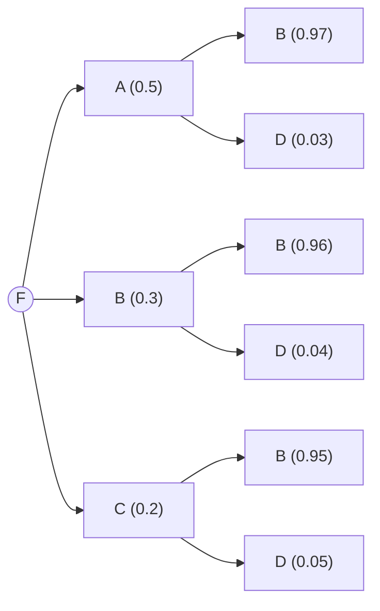

# Unidad 3: Teoría de Probabilidad
## Sucesos Mutuamente Excluyentes

Los sucesos A y B son mutuamente excluyentes o incompatibles entre sí \( A \cap B = \varnothing \), es decir si cuando ocurre uno no puede ocurrir el otro.
(sin aclaración los eventos no son mutuamente excluyentes).

## Axiomas

### Axioma 1 
Para todo suceso A, se cumple que \( 0 \leq P(A) \leq 1 \)

### Axioma 2
Para el espacio muestral se cumple que \( P(E)=1 \)

### Axioma 3
Si A y B son dos eventos mutuamente excluyentes del espacio muestral, entonces \( P(A \cup B) = P(A) + P(B) \)

## Teoremas 

### Teorema 1
Si \( \varnothing \) es el conjunto vacío entonces \( P( \varnothing ) = 0\)

### Teorema 2
Si \( A^c \) es el complementod de un suceso A, entonces \( P(A^c) = 1 - P(A) \)

### Teorema 3
Si A está incluido en B, entonces \( P(A) \leq P(B) \)

### Teorema 4
Si A y B son dos sucesos, entonces \( P(A - B) = P(A) - P(A \cap B) \)

### Teorema 5: 
Si A y B son dos sucesos entonces \( P(A \cup B) = P(A) + P(B) - P(A \cap B) \)

## Probabilidad Condicional

**Ejemplo**

De un mazo de cartas españolas se extrae una carta al azar. La probabilidad que esta carta resulte ser un As de Espada es 1/40, supongamos que sabemos que esta carta resultó ser de espada, entonces la probabilidad de que sea un As es 1/10.

\( P(B \mid A) = \dfrac{P(A \cap B)}{P(A)} = \dfrac{\frac{1}{40}}{\frac{10}{40}} = \frac{1}{40}\cdot\frac{40}{10} = \frac{1}{10} \)

A = es de espada
B= es un As

### Problema 1
La probabilidad de que un alumno apruebe Álgebra es de 0,7. La probabilidad de aprobar Análisis Matemático es 0,6 y la de que aprueba ambas es 0,55. ¿Cuál es la probabilidad de que apruebe Análisis si no aprobó Álgebra?.

\(P(An \mid Al) = \frac{P(An \cap Al)}{P(Al)}\)

\(P(An \mid Al) = \frac{0.05}{0.25 + 0.05} = \frac{0.05}{0.30} = 0.1666\ldots \)

###  Problema 2

De un cierto grupo de personas se sabe que el 80% son morochos, que el 25% son fumadores y que los que son morochos y fumadores constituyen el 85% del grupo.
Calcula la prob de elegir un fumador y que este resulte ser morocho.

<!-- P(MUF) = P(MUF)/P(MNF) = P(F)+P(M)-->
\(P(M \cup F) = 0.85\)

\(P(M \cup F) =P(F) + P(M) - P( M \cap F)\)

\(0.85 = 0.25 + 0.80 - P(M \cap F)\)

\(0.2 = P(M \cap F)\)

entonces: 
\(P(M \mid F) = \frac{P(M \cap F)}{P(F)} = \frac{0.2}{0.25} = 0.8\)

La probabilida de de elegir un fumador y que resulte ser morocho es 80% (0,8).

# Teorema de la Probabilidad Total

Mostraremos a través de un diagrama una partición del espacio muestral. De un experimento en 4 sucesos B1, B2, B3 y B4 y la representación de un suceso cualquiera A. 

Los sucesos que forman parte de una partición deben cumplir determinadas condiciones:

+ La intersección de los 4 sucesos tomados de 2 en 2 es vacía.
+ La intersección de los 4 sucesos nos dá el espacio muestral.
+ Cada Suceso no es un conjunto vacío.

**Ejemplo:**

3 máquinas A,B y C producen respectivamente 50%, 30% y 20% del número total de artículos de una fábrica.
Los porcentajes de despefectos de producción de estas máquinas son 3%, 4% y 5%. Si se selecciona un artículo al azar, hallar la prob de que el artículo sea defectuoso.

\(P(D) = 0.5 \cdot 0.03 + 0.3 \cdot 0.04 + 0.2 \cdot 0.05\)

# Teorema de Bayes

Continuando con el ejemplo antrior. Suponemos que se selecciona un artículo al azar y este resulta defectuoso ¿Cuál es la probabilidad de que el artículo seleccionado fue producido por la máquina A?

<!-- P=(A/D)= P(AND)/ P(D) = 0,5 . 0,08 / 0,037 = 0,015/ 0,057 -->

\(P(A \mid D) = \frac{P(A \cap D)}{P(D)} = \frac{0.5 \cdot 0.03}{0.5 \cdot 0.03 + 0.3 \cdot 0.04 + 0.2 \cdot 0.05} = \frac{0.015}{0.037}\)

\( P(A \mid D) = 0.405405405\ldots\)

La probabilidad de que el artículo resulte defectuoso selecionado fue producido por la máquina A es 40,5%.